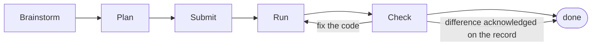

# Until

The outer loop for coding agents.

Until moves the important decisions into the Plan before a coding agent writes any code. It then enforces that Plan during implementation and checks the resulting pull request against it.

For individual developers and teams whose agents can produce code faster than they can confidently review it.

This plugin connects Cursor, Claude Code, Codex and Pi to Until, guiding the agent through the Until Loop.

The open-source plugin runs alongside your coding agent. The hosted Until workspace stores Plans and, once you connect source control, links them to pull requests and runs Plan checks.

## Quickstart

Install Until in Claude Code:

```text
claude
> /plugin marketplace add until-dev/plugins
> /plugin install until@until
```

Restart the session, run `/mcp` to complete authentication, then start a fresh conversation. Until will guide you through creating a workspace. You can connect source control later, when you submit your first Plan for repository-backed work.

Installation instructions for Codex, Cursor and Pi are [below](#install).

## Documentation

- [Set up Until](docs/setup.md)
- [Run your first Until Loop](docs/first-until-loop.md)
- [Plan approvals](docs/plan-approvals.md)
- [Plan checks](docs/plan-checks.md)
- [Custom Loops](docs/custom-loops.md)
- [Troubleshooting](docs/troubleshooting.md)

## The Until Loop

A change stays in the Until Loop until the implementation matches the Plan.



1. **Brainstorm** with your coding agent until the shape of the change is clear.
2. **Plan** the work in enough detail for someone else to understand and build it.
3. **Submit** the Plan as the target for implementation. If its saved policy requires Review, another person must approve it before implementation.
4. **Run** the Plan with your coding agent. Until keeps the Plan attached to the work while the agent implements it.
5. **Check** the pull request against the Plan. Where they differ, fix the code, correct the Plan, or acknowledge the difference on the record.

## The Until Rule

> No code until the Plan is agreed.

How the Plan is agreed depends on its saved Review policy. Plans that do not require Review proceed after submission is confirmed. Plans that require Review need another person's approval before implementation.

The argument behind the rule is our manifesto, [AI Is Not Your Peer](https://www.notyourpeer.com/). A coding agent cannot defend its decisions like a human author. The Plan records the intent before someone has to reconstruct it from a finished pull request.

## Plan checks

After a pull request opens, Until compares it with the Plan and reports anything missing, changed or outside its scope.

Plan checks require a source-control connection. When you submit your first Plan for repository-backed work, Until will guide you through connecting your provider. It later links the pull request to that Plan and checks again whenever new code is pushed.

A difference is not automatically a failure. You can ask the agent to fix the code, correct and reclear the Plan, or have an authorized person acknowledge the difference on the record. A check is successful only when no differences remain; acknowledged differences produce a neutral, non-blocking outcome.

## Extend with Custom Loops

Custom Loops handle the paperwork around a change: updating tickets, refreshing stale documentation and reporting progress in Slack.

They are written in Markdown and kept in git, so you can inspect and change them alongside the rest of your development process.

## Install

### Requirements

- Cursor, Claude Code, Codex or Pi
- macOS or Linux
- `python3` on `PATH` for the Claude Code and Cursor enforcement hooks

Windows is not supported yet. The skills that teach the Until Loop may load, but the hooks that track Plan state and enforce the Until Rule are not reliably launched or validated there. Nothing on Windows will stop an agent from writing code without a Plan.

### Claude Code

Follow the [Quickstart](#quickstart). Claude Code loads its enforcement hooks from the plugin, so there is no separate hook-installation step.

### Codex

Install Until through Codex's plugin marketplace:

```bash
codex plugin marketplace add until-dev/plugins
codex plugin add until@until
```

Restart Codex and start a new task. The plugin registers Until's MCP server automatically.

### Cursor

Clone the plugin into a permanent location:

```bash
git clone https://github.com/until-dev/plugins.git ~/src/until-plugins
mkdir -p ~/.cursor/plugins/local
ln -s ~/src/until-plugins ~/.cursor/plugins/local/until
```

Install the user-level enforcement hooks:

```bash
cd ~/src/until-plugins
./hooks/install-user-hooks.sh
```

Reload the window with **Developer: Reload Window**, then start a fresh chat.

The extra hook installation is a platform limitation rather than a design choice. Cursor dispatches plugin-shipped hooks for `sessionStart`, but the enforcement events (`afterMCPExecution`, `beforeShellExecution`, `preToolUse`) load only from the user or project `hooks.json` chain.

The enforcement hooks are inactive in ordinary conversations until Plan submission or source-control setup begins. A repository containing `.until-method` is enforced before a Plan exists. Installing the hooks globally is therefore safe.

### Pi

Before the npm release, install the tagged Until release from the public Git
repository:

```bash
pi install git:github.com/until-dev/plugins@v0.2.5
```

For local pre-release testing, point Pi at this plugin directory instead:

```bash
pi install /absolute/path/to/workspace/plugins
```

Start Pi, run `/mcp-auth until`, and complete authentication in the browser.
Then start a fresh session. Until's skills and startup guidance should be
available, and `/mcp` should show the Until server.

This first Pi release supports the Until workflow and MCP tools. Pi does not
load the deterministic Cursor and Claude Code enforcement hooks.

### Verify the installation

Start a fresh conversation and ask your agent to implement a small change.

Until should begin by helping you shape the change and create a Plan before writing code. After the Plan is cleared, it should stop again until you explicitly start implementation. If either stop is missing, follow the [enforcement troubleshooting steps](docs/troubleshooting.md#the-agent-starts-implementing-before-there-is-a-plan). In an ordinary repository, pre-Plan behaviour comes from the plugin's session guidance; user-level hooks begin enforcement when submission or source-control setup starts. A `.until-method` repository is enforced before submission.

### Updating

Claude Code updates through the plugin manager.

Update Until through Codex's plugin manager, then restart Codex.

On Cursor, update the cloned repository and reload the window:

```bash
cd ~/src/until-plugins
git pull
```

The existing hook entries point into that clone and do not need reinstalling after an ordinary pull. If the clone moved or the hooks are missing, follow [Troubleshooting](docs/troubleshooting.md#until-enforcement-hooks-do-not-run).

Refresh the installed Pi package at its pinned Git tag with:

```bash
pi update --extensions
```

Git tags are immutable. To move to a later Until release, remove this tagged
source and install the newer tagged source.

### Uninstalling

On Claude Code, remove the plugin through the plugin manager.

On Codex, remove the plugin and marketplace:

```bash
codex plugin remove until@until
codex plugin marketplace remove until
```

On Cursor, delete the plugin symlink and remove the Until entries from your user-level `hooks.json`.

On Pi, remove the package:

```bash
pi remove git:github.com/until-dev/plugins@v0.2.5
```

## Bypassing the Until Loop

Tell your agent not to use the Until Loop for the current change.

Clicking Build or saying "looks good" does not count, and the agent cannot make that choice for you. Until explains what you are giving up. When enforcement is active, it also gives you a session-specific bypass command that you must run in your own terminal; the agent cannot run it for you.

## FAQ

**How is this different from Superpowers?**

Until adapts parts of Superpowers' brainstorming and planning method, with thanks to its contributors. Until adds shared Plans, optional Plan approval, deterministic enforcement and pull request checks against the Plan. See the [License](#license) for attribution.

**Does every change need a Plan?**

The Until Rule applies to changes an agent implements. You can bypass it for a particular change.

**What happens if the agent ignores the Plan?**

The Plan check reports the difference on the pull request. You can ask the agent to fix the code, correct the Plan, or acknowledge the difference on the record. Either way, the difference requires a decision from you.

## Support

- **Issues:** [github.com/until-dev/plugins/issues](https://github.com/until-dev/plugins/issues)
- Until is built by the team behind [AI Is Not Your Peer](https://www.notyourpeer.com/).

## License

MIT — see [LICENSE](LICENSE).

Portions of Until are adapted from [obra/superpowers](https://github.com/obra/superpowers), created by Jesse Vincent and distributed under the MIT License. The combined license preserves the copyright notices for both projects.
