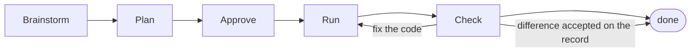

# Until

The outer loop for coding agents.

Until moves peer review onto the Plan, while decisions are still easy to change and before a coding agent writes any code. For teams where agent-written PRs have started to outrun meaningful review.

This plugin connects Cursor and Claude Code to Until, guiding the agent through the Until Loop and enforcing it while you work.

## Quickstart

In Claude Code:

```text
claude
> /plugin marketplace add until-dev/plugins
> /plugin install until@until
```

Restart the session, run `/mcp` to complete the OAuth, then start a fresh conversation.

You'll need an Until workspace connected to your source-control provider — create one at [until.dev](https://until.dev). Cursor setup is [below](#cursor).

## The Until Loop

A change stays in the Until Loop until the implementation matches the Plan.



1. **Brainstorm** with your coding agent until the shape of the change is clear.
2. **Plan** the work in enough detail for someone else to understand and build it.
3. **Approve** — the Plan is cleared under your workspace's review policy. For team work, that means another person reviews it before implementation begins.
4. **Run** the Plan with your coding agent.
5. **Check** the Pull request against what the team agreed. Where they differ, fix the code, accept the difference on the record, or take the work back to the Plan.

## The Until Rule

> No code until the Plan is agreed.

For team work, another person reviews the Plan before implementation starts. Solo users can continue after submitting their Plan without pretending to review their own work.

The argument behind the rule is our manifesto, [AI Is Not Your Peer](https://www.notyourpeer.com/): reviewing an agent's Pull request is auditing a machine, and the Plan is the part a person actually decided.

## Plan checks

After a Pull request opens, Until compares it with the Plan and reports anything missing, changed, or outside the agreed scope.

Plan checks require the repository to be connected to Until through its source-control provider. Until links the Pull request to its Plan and runs the check again whenever new code is pushed.

A difference is not automatically a failure. The agent can fix the code or an authorized person can accept the difference on the record. The Plan check passes once nothing remains unaddressed.

## Extend with Custom Loops

Custom Loops let Until handle the paperwork around a change — updating tickets, refreshing stale docs, reporting status in Slack. They're written in Markdown and kept in git, so the team reviews and changes them like any other code.

## Install

### Requirements

- An [Until workspace](https://until.dev), with a source-control provider connected to it
- Cursor or Claude Code
- macOS or Linux
- `python3` on `PATH`, for the enforcement hooks

Windows is not supported yet. The skills that teach the Until Loop may load, but the hooks that track Plan state and enforce the Until Rule are not reliably launched or validated there, so nothing on Windows will stop an agent writing code without a Plan.

### Claude Code

Follow the [Quickstart](#quickstart). Claude Code dispatches every hook event from the plugin's own `hooks.json`, so there is no extra step. The VS Code extension shares user-level plugin state, so one install covers both.

### Cursor

1. Clone `until-dev/plugins`, then add the folder as a plugin or symlink it into Cursor's local plugin directory: `ln -s ~/src/plugins ~/.cursor/plugins/local/until`.
2. Run `./hooks/install-user-hooks.sh` once.
3. Reload the window (Developer: Reload Window) and start a fresh chat.

Step 2 is a platform limitation rather than a design choice. Cursor dispatches plugin-shipped hooks for `sessionStart`, but the enforcement events (`afterMCPExecution`, `beforeShellExecution`, `preToolUse`) load only from the user or project `hooks.json` chain, so the hard rails have to be installed at user level for now. The gate is inert in conversations with no Until Plan in flight, so installing it globally is safe.

### Updating

Claude Code updates through the plugin manager. On Cursor, pull the latest in your clone and reload the window; if the hooks changed, run `./hooks/install-user-hooks.sh` again.

### Uninstalling

On Claude Code, remove the plugin through the plugin manager. On Cursor, delete the symlink and remove the Until entries from your user-level `hooks.json`.

## Bypassing the Until Loop

Tell your agent not to use the Until Loop for the current change. Clicking Build or saying "looks good" does not count, and the agent cannot make that choice for you. Until explains what you are giving up, then stands aside.

## FAQ

**How is this different from Superpowers?**
Until adapts parts of Superpowers' brainstorming and planning method (with thanks — see [License](#license)). Until adds workspace review policy, deterministic enforcement, and Pull request checks against the cleared Plan.

**Does every change need a Plan?**
The Until Rule applies to changes an agent implements. You can bypass it per change, on the record.

**What happens if the agent ignores the Plan?**
The Plan check on the Pull request reports the difference. Someone fixes the code, accepts the difference, or takes the work back to the Plan — either way, it's a decision a person made, recorded.

## Support

- **Issues**: [github.com/until-dev/plugins/issues](https://github.com/until-dev/plugins/issues)
- Until is built by the team behind [AI Is Not Your Peer](https://www.notyourpeer.com/).

## License

MIT — see [LICENSE](LICENSE).

Portions of Until are adapted from [obra/superpowers](https://github.com/obra/superpowers), created by Jesse Vincent and distributed under the MIT License. The combined license preserves the copyright notices for both projects.
