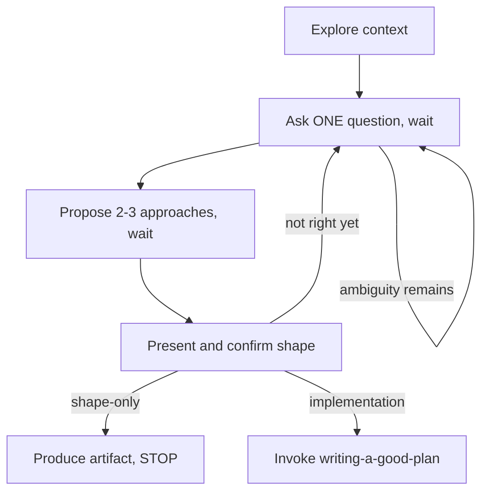

<!-- Portions adapted from obra/superpowers, MIT License,
     Copyright (c) 2025 Jesse Vincent.
     https://github.com/obra/superpowers/blob/main/LICENSE -->

# Brainstorming an Idea Into a Shape

A **shape** is the agreed statement of what to build: the intended output,
the chosen approach, what's out of scope, and what "done" looks like. This
skill turns your partner's idea into that shape through natural collaborative
dialogue — understand the intent, resolve the ambiguities, pick an approach
together. The caller has already classified the current deliverable as either
**shape-only** or **actual implementation**. Preserve that route:

- Shape-only → produce the agreed artifact and stop.
- Actual implementation → hand the agreed shape to `writing-a-good-plan`.

<HARD-GATE>
Do NOT draft a plan, call submit_plan, write implementation code, or take any
implementation action until you have presented the shape and your partner has
agreed to it. ("Agreed" here is a conversation checkpoint — the word
"approved" is reserved for Until review verdicts.)

For shape-only work, do not create the artifact until the shape is agreed.
After agreement, create only the requested artifact and stop. A repository
artifact must be Markdown under `docs/design/` or `docs/specs/`
and stays uncommitted.

Every task that reaches this skill has a real conversation: it spans multiple
turns and contains at least two replies from your partner. If this is still
your first message, you cannot be done brainstorming.
</HARD-GATE>

## Anti-Pattern: "This Is Too Simple To Brainstorm"

Every shape-only or implementation task routed here goes through the
conversation. Admin/tracker/paste-ready copy never enters this skill; produce
that directly. Small implementation changes still get a short brainstorm and
plan. A narrow shape-only request gets a short brainstorm and artifact. Short
is allowed; collapsing the selected route into another route is not.

## Checklist

Create a TodoWrite item for each and complete them IN ORDER. Items 2–4 end
with a question — end your turn there and WAIT for the answer:

1. **Explore project context** — files, docs, recent commits, existing
   patterns. What already exists? What's the real goal behind the ask?
   While exploring, mark what is already SETTLED — closed PRs, completed
   investigations, decisions your partner or the ticket already recorded.
   Settled work is a premise, not an option: state it as a given, never
   propose re-doing it, and don't spend clarifying questions re-opening it.
2. **Ask clarifying questions** — exactly ONE per message: purpose,
   constraints, success criteria, what's explicitly OUT of scope. Prefer
   concrete options over open-ended questions. Repeat until the ambiguities
   are resolved.
3. **Propose 2–3 approaches** — trade-offs and your recommendation, then ask
   which they want.
4. **Present the shape and confirm it.** Give a few sentences to a short
   section: what the agreed output is, the chosen approach, what's out of
   scope, and what "done" looks like. Ask: "Is this the thing you want?"
   - For **shape-only**, stop after the agreed artifact; there is no delivery
     handoff in this route.
   - For **actual implementation**, hand the agreed shape to planning. Do not
     ask who builds it or treat the original implementation request as
     permission to submit or build. Submission and implementation each have a
     later, explicit checkpoint.
5. **Finish the selected route.**
   - **Shape-only:** produce the agreed artifact and report it. Before stopping,
     state that the shape-only work is complete and name the user-controlled
     next step: "The shape is agreed. If you want to build it, ask me to move
     this into implementation planning." This is a handoff, not permission to
     invoke `writing-a-good-plan`, ask for review, or continue toward a build.
     Then STOP.
   - **Actual implementation:** hand off only to `writing-a-good-plan`. Carry
     material resolved decisions into the plan as outcomes, rationale,
     boundaries, and externally consumed contracts. Do not turn brainstorming
     choices into internal
     type/signature/code specifications; unstated internals belong to the
     implementer. Don't re-ask what was already answered.

## How to run the conversation

- **One question per message.** A list of five questions is an interrogation
  form, not a conversation. If a topic needs more exploration, that's more
  turns, not a longer message.
- **Multiple choice when possible** — easier to answer, faster to converge.
- **Size the scope early.** If the ask contains multiple independent concerns
  ("add X and refactor Y"), flag it now and split — one shape per plan.
  Don't spend questions refining details of something that needs decomposing
  first (see the sizing zones in `writing-a-good-plan`).
- **YAGNI ruthlessly** ("you aren't gonna need it"). Strip features your
  partner didn't ask for from every approach you propose.
- **Follow the codebase.** Propose changes that fit existing patterns; don't
  smuggle in unrelated refactoring.
- **Be flexible.** If an answer invalidates your mental model, go back a step
  — better now than in review.

## Red Flags — STOP, you're skipping the conversation

| Thought | Reality |
|---------|---------|
| "The request is clear, no questions needed" | At minimum: out of scope? done means? Ask — one at a time. |
| "I'll ask all my questions in one go" | One per message. End your turn. Wait. |
| "This is trivial, straight to the plan" | Trivial = short brainstorm, never no brainstorm. |
| "Is there a fast-track for small changes?" | No. Looking for one means you're rationalizing. |
| "I'll brainstorm and draft in this same turn" | Two partner replies minimum. Physically impossible in one turn. |
| "They seem impatient, better to just produce something" | Producing the wrong thing is slower. One good question beats a fast guess. |
| "They asked to implement, so the later plan can submit or build automatically" | The initial ask starts shaping only. Draft submission and post-clearance implementation each need a fresh instruction. |
| "Option A: redo that investigation, just to be safe" | The context told you it's done. Settled work is a premise — options start from where reality is. |
| "This Linear description is about a feature, so it needs brainstorming" | The requested output is copy. Produce it directly; do not route by hypothetical future work. |
| "The shape is agreed, so I should keep going into a plan" | Only for actual implementation. Shape-only means create the artifact and stop. |
